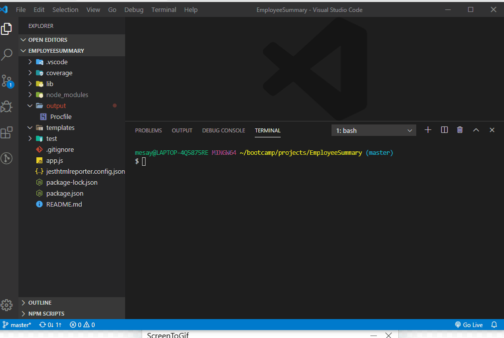

# Employee Summary

Command line application to generate software engineering team profile.

## Installation

Install dependencies using ``` npm-install``` or ``` npm-i```

To start using the app use :

```bash
'node app.js'
```


## Usage
 The application will prompt the user for information about the team manager and then information about the team members. The user can input any number of team members, and they may be a mix of engineers and interns.

   The application will create an HTML file that displays a nicely formatted team roster based on the information provided by the user



## Tools Used
HTML5, Bootstrap 4, JavaScript, Node.js, Inquirer node module,Jest, jest-html-reporter 
